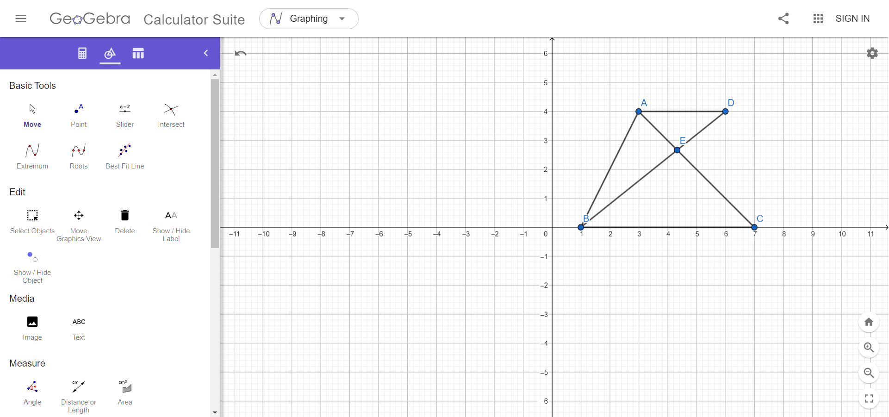
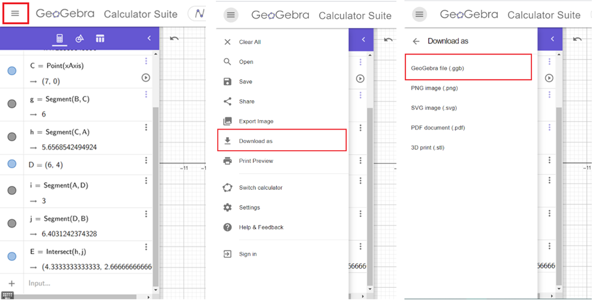

# GeoAD
Advanced Geometric Descriptor - geometry problem solver with the "argument-explanation" method.
## How to use it?
### Create the problem with GeoGebra
Draw your geometry problem (no need to be exact, just a rough drawing). The program can import your points coordinates from GeoGebra, so you wouldn't have to type it manually.
[GeoGebra website](https://www.geogebra.org/calculator)

### Download drawing from GeoGebra
In order to import your points' coordinates, download .ggb file from GeoGebra.

### Add problem data with python code
Use the Helper object to code your problem data and call `Helper.calc()` in order to solve your problem.
```python
def p353_e27(print_proof=True):
	h = Helper()
	h.ps_from_file(r"ggb_test\p353_e27.ggb")
	# can also be written as:
	# h.ps("ABCDE", [0, 0, 6, 4, 2.4], [4, 0, 0, 4, 2.4])
	h.s("AB", "BC", "CEA", "AD", "DEB")
	h.paras("AD", "BC")
	h.seta("DAC", 42)
	h.seta("CEB", 94)
	h.calc(print_proof)
	return (h.geta("EBC"),), (44,)
```
## The Helper API
Functions from the Helper class, used to give problem input and retrieve geometry objects:
`ps(names,xs,ys)` Create and return multiple points using their names and coordinates.
`ps_from_file(path)` Create and return multiple points from .gbb file.
`s(*names)` Create and return segments from names.
`a(*names)` return angles from names.
`given(cls,symbol)` Create and return new Degree/Length from symbol (such as alpha or x).
`tri(*names)` Create triangles from names.
`poly(*names)` Create polygons from names.

Triangles inner lines:
`tri_med(tri,name)` Create a median by name inside triangle.
`tri_angbi(tri,name)` Create an angle bisector by name inside triangle.
`tri_alt(tri,name)` Create an altitude by name inside triangle.
`tri_segbi(tri,name,side)` Create a segment bisector by name to side in triangle.

Set/Get/Equal or Calc Functions:
`seta(name,deg)` Set angle by name to be equal to degree.
`seta(name,leng)` Set segment by name to be equal to length.
`geta(*names)` Return angles' degrees by names.
`gets(*names)` Return segments' lengths by names.
`equala(name1,name2)` Set angle name1 to be equal to angle name2.
`equals(name1,name2)` Set segment name1 to be equal to segment name2.
`calc(print_proof=True)` prove new data from input data.

Segment Functions:
`conts(og,new)` Continue existing og segment to new segment.
`perps(seg1,seg2)` Set segments to be perpendicular
`paras(*names)` Set segments to be parallel by names.
`isparas(name1,name2)` Check if segments are parallel.
## Setup
Create your problem in a python file and run. Import classes if necessary from geo folder.
There are many examples in [yoel_geva.py](yoel_geva.py) or [proofs.py](proofs.py).
## How it works?
Read my paper about how my project fully works [here](GeoAD.pdf).

